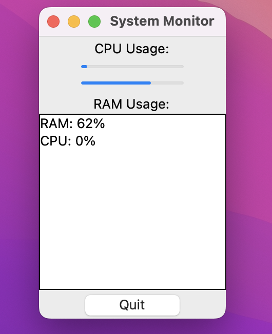
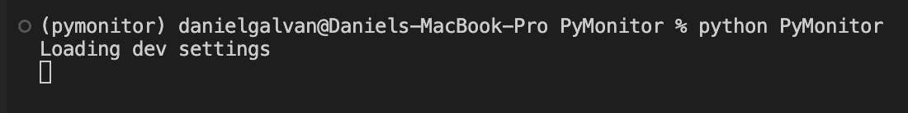

## Python Activity Monitor 

🐍



A simple python GUI application using the built in Tkinter GUI. The simple application demonstrates the use of
import Python concepts. OOP is used to create the GUI, Threading is used to demonstrate how to run the usage stats off of the main thread. A simple 'config' module is provided using a cache to demonstrate how to keep settings and code separate. Some 'type hinting' used with Pydantic.

to build and run on your system you can install of the required packages from the included requirements file.

requirements.txt 

Note:

you should always create a virtual environment for your project! How you do it is completely up to you..(pyenv, poetry, venv, etc.)

I demonstrate venv since it is built in to Python:

```python3 -m venv env --prompt myproject ```


to activate:
on Unix/Linux/MacOS 
```source env/bin/activate```

on Windows:
```cd env/bin```
```activate```
or on PowerShell (I am not a Windows user so you may need to look the following up.)

```Activate.ps1```

Finally install the requirements:

``` pip install -r requirements.txt```


To run the app you can simply run from the terminal or create a shortcut, a shell script etc.

```python PyMonitor```


